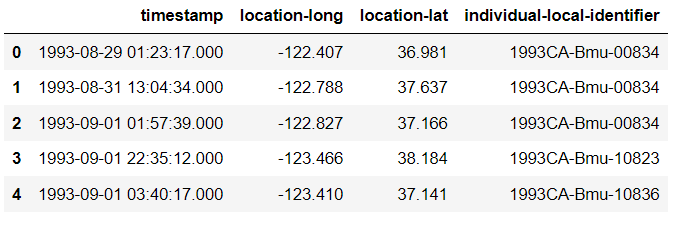
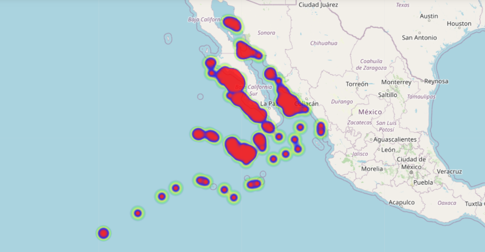
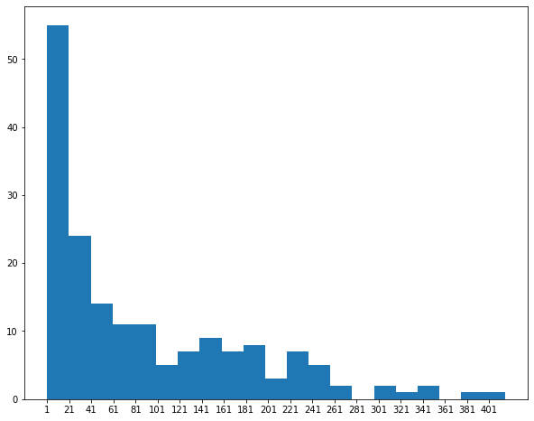

# Modeling-Animal-Movement-
Machine learning for modeling animal movement

# Table of Contents
1. [Setup]()
2. [Eastern North Pacific 1993-2008 Argos Dataset]()
    1. [Inspect and cleaning]()
    1. [Split the data]()
3. [Data windowing]()
4. [features and labels]()
5. [Recurrent Neural Network]()
    1. [LSTM]()
6. [Metrics]()
7. [Conclusion]()
8. [References]()

___________________________________________________

## Setup 

## Whales dataset 🐳

During the period 1993 to 2007, Argos satellite tags were attached to 159 whales, mainly off the coast of California during late summer, of which 92 tracks were >7 d in duration. 

There are 15545 different deployed locations from 143 animals across the years present in this dataset. Also, it contains the date, the time and the individual-local-identifier.
This  dataset is avaliable in [Movebank.org](https://www.movebank.org/cms/webapp?gwt_fragment=page=studies,path=study650188969)

Let's take a glance at the data. Here are the first few rows:

Here is the evolution of the whale's route (latitude,longitude) over time:

Mostly whales has short routes of few points. I chosed routes with a minimun of 40 points in order to get enough size data by animal.

### Inspect and cleaning dataset 

Before building a model, it's important to understand the data and be sure that you're passing the model appropriately formatted data.

### transforming dataset

I removed NaN, empty and duplicated values and some irrelevant data for my model, like event-id, sensor type, study name... and sorted and chopped my dataset by year. 

#### timestamp

This  column gives the complete date and time in hh:mm:ss format. Event record is accurate to a small fraction of a second. But model can't interprete this data like a date, so I used the module datetime for manipulating dates and times. This way I could separate dates and time in differents columns.

### Split the data

I used a (70%, 20%, 10%) split for the training, validation, and test sets. Note the data is not being randomly shuffled before splitting. 

## Data windowing

The model will make a set of predictions based on a window of consecutive samples from the data.

The main features of the input windows are:

* The width (number of time steps) of the input and label windows.
* The time offset between them.
* Which features are used as inputs, labels, or both.

My objective is to make a single prediction, a new point in the whale route, given 20 previous points.

I define a function that generate batches of these windows from the training, evaluation, and test data using timeseries_dataset_from_array from keras tensorflow.

## Features and labels

To split windows of features into features, and labels pairs I made another function. Now, I have mapDatasets for train, test and val. 

## 

