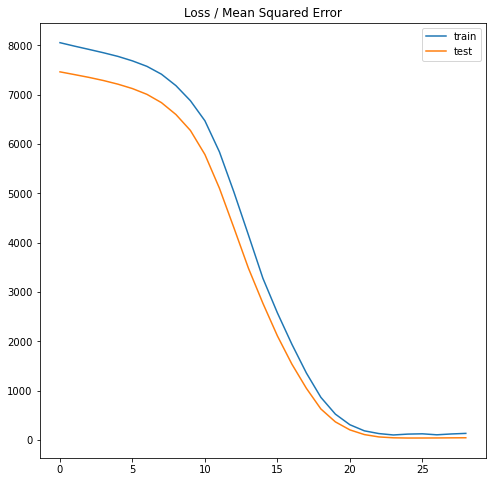
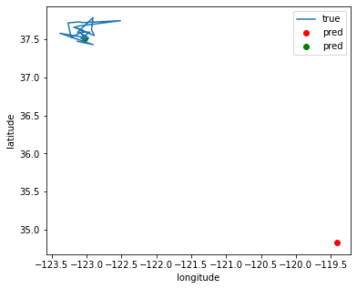
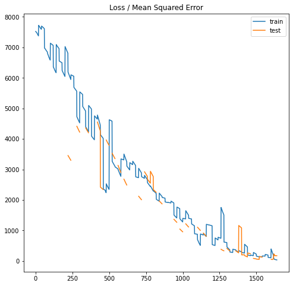

# Modeling-Animal-Movement-
Machine learning for modeling animal movement

# Table of Contents
1. [Setup]()
2. [Eastern North Pacific 1993-2008 Argos Dataset]()
    1. [Inspect and cleaning]()
    1. [Split the data]()
3. [Data windowing]()
4. [features and labels]()
5. [Recurrent Neural Network]()
    1. [LSTM]()
6. [Metrics]()
7. [Conclusion]()
8. [References]()

___________________________________________________

## Setup 

## Whales dataset 🐳

During the period 1993 to 2007, Argos satellite tags were attached to 159 whales, mainly off the coast of California during late summer, of which 92 tracks were >7 d in duration. 

There are 15545 different deployed locations from 143 animals across the years present in this dataset. Also, it contains the date, the time and the individual-local-identifier.
This  dataset is avaliable in [Movebank.org](https://www.movebank.org/cms/webapp?gwt_fragment=page=studies,path=study650188969)

Let's take a glance at the data. Here are the first few rows:

Here is the evolution of the whale's route (latitude,longitude) over time:

Mostly whales has short routes of few points. I chosed routes with a minimun of 40 points in order to get enough size data by animal.

### Inspect and cleaning dataset 

Before building a model, it's important to understand the data and be sure that you're passing the model appropriately formatted data.

### transforming dataset

I removed NaN, empty and duplicated values and some irrelevant data for my model, like event-id, sensor type, study name...remains only latitude and longitude sorted and chopped by year. 

#### timestamp

This  column gives the complete date and time in hh:mm:ss format. Event record is accurate to a small fraction of a second. But model can't interprete this data like a date, so I used the module datetime for manipulating dates and times. This way I could separate dates and time in differents columns.

### Split the data

I used a (70%, 20%, 10%) split for the training, validation, and test sets. Note the data is not being randomly shuffled before splitting. 

## Data windowing

The model will make a set of predictions based on a window of consecutive samples from the data.

The main features of the input windows are:

* The width (number of time steps) of the input and label windows.
* The time offset between them.
* Which features are used as inputs, labels, or both.

My objective is to make a single prediction, a new point in the whale route, given 20 previous points.

I define a function that generate batches of these windows from the training, evaluation, and test data using timeseries_dataset_from_array from keras tensorflow.

## Features and labels

To split windows of features into features and labels pairs I made another function which returns mapDatasets for train and test.

* Features: my input data. Six columns of latitude and longitude sorted by year/animal.
* Test: the output data. I'm trying to predict the next point (given by a [latitude,longitude]) in an anual whale route.

## Recurrent Neural Network 

Migration is an example of time series data. So I chose a recurrent Neural Network (RNN) called Long Short-Term Memory (tf.keras.layers.LSTM).

An important constructor argument for tf.keras.layers.LSTM, is the return_sequences argument.If False, the default, the layer only returns the output of the final time step, giving the model time to warm up its internal state before making a single prediction.

## Metrics 

Although the mean squared error is elevated, the curve of loss/mean squared error fits well to test data. Both have similar behaviour.

The result of the prediction (latitude,longitude coordenates) are quite far of the actual points.

Despite the similarities between the routes of different individuals, it is not possible to train the model with all of them as a set. The loss and train_loss values show steep ups and downs when this occurs, and there are even gaps in the validation data.

## Conclusion 

Predict the next point of a route it's complicated. The main problem is make a good data presentation for the model and find a lot of points of the same individuous across the time to make enough windows data to predict the next point on a route given latitude and longitude. 

Other variables related with position like speed maybe be useful to improve the model. 
